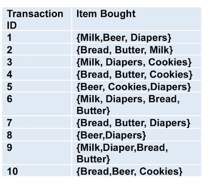
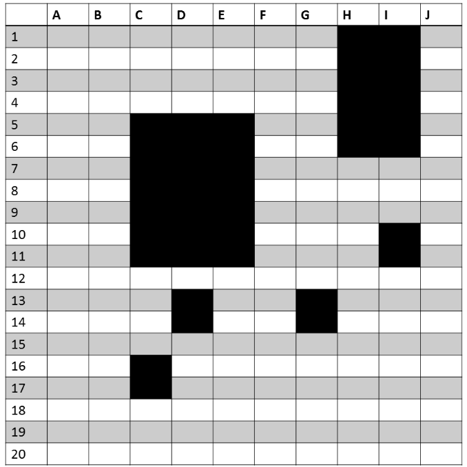
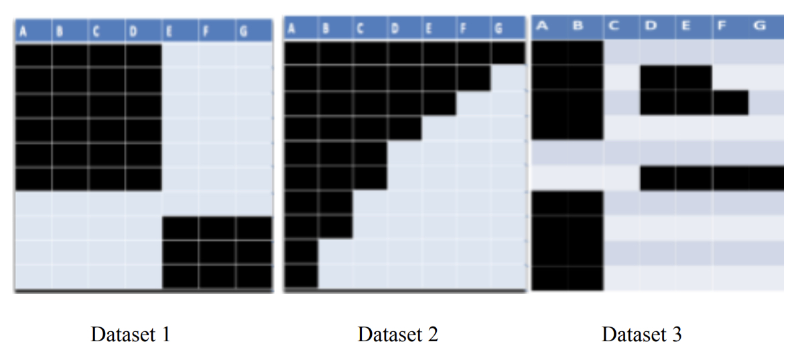
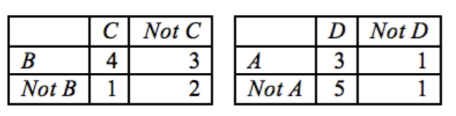
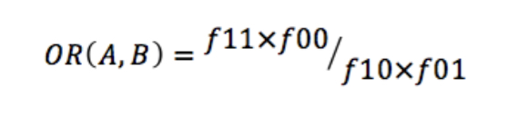
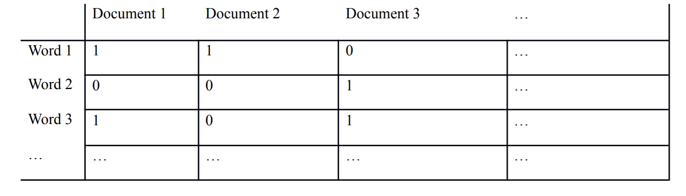

```{r setup, include=FALSE}
knitr::opts_chunk$set(echo = TRUE)
```

## Question 1

\textbf{Consider the market basket transactions shown in the table below:}



\textbf{What is the maximum number of association rules that can be extracted from this data (including rules that have zero support)?}

\begin{equation}
  \begin{split}
  R=3^d-2^{d+1}+1=3^6-2^7+1=602
  \end{split}
\end{equation}
  
\textbf{What is the maximum size of frequent itemsets that can be extracted (assuming minsup > 0)?}

4, assuming the question is asking for the size of a single itemset and not the total number of possible Itemsets (which would be 2^6-1)

\textbf{Write an expression for the maximum number of size-3 itemsets that can be derived from this data set.}

\begin{equation}
  \begin{split}
  {6\choose3} = 20
  \end{split}
\end{equation}

\textbf{What are the support counts for \{Bread\}, \{Milk\}, and \{Bread, Milk\}?}

\{Bread\}: 6

\{Milk\}: 5

\{Bread, Milk\}: 3

\textbf{What are the confidence of the rules \{Bread\} -> \{Milk\} and \{Milk\}->\{Bread\}?}

\{Bread\}→\{Milk\}: 3/6=.5

\{Milk\}→\{Bread\}: 3/5=.6

\textbf{Find a pair of items, a and b, such that the rules \{a\} -> \{b\} and \{b\} -> \{a\} have the same confidence}

\{Beer, Cookies\}

\{Beer\}→\{Cookies\}: 2/4=.5

\{Cookies\}→\{Beer\}: 2/4=.5

\newpage

## Question 2

\textbf{Suppose ACD is a frequent itemset and AB is NOT a frequent itemset. Given this information, we can be sure that certain other itemsets are frequent and sure that certain itemsets are NOT frequent. Other itemsets may be either frequent or not. Which of the following is a correct classification of an itemset?}

Give a one sentence explanation if you believe any statement is incorrect.

a) A is frequent.

True

b) CD can be either frequent or not frequent.

False, all subsets of ACD are frequent by the a priori principal

c) ACDE can be either frequent or not frequent.

True

d) ABCD is frequent.

False, any superset of AB cannot be frequent by the anti-monotone property

e) ABCDE can be either frequent or not frequent

False, same reasoning as in d.

\newpage

## Question 3

The figure below depicts a transaction matrix with 10 items and 20 transactions. Dark cells indicate the presence of items, and white (or grey) cells indicate the absence of items. We apply the Apriori algorithm to extract frequent itemsets with minsup=20% (i.e., itemsets must be contained in at least 4 transactions).

Answer the following questions:



a. List all the maximal frequent itemsets in the dataset.

HI

CDE

b. List all the frequent itemsets in the dataset.

HI

CDE

C

I

H

D

E

c. List all the closed frequent itemsets in the dataset

HI

CDE

C

D

I

\newpage

## Question 4

Consider a dataset with 6 items: U,V,W,X,Y,Z and 50 transactions. You are given partial information about the support count of some itemsets as follows:

\{U,V,W\}: support count = 35

\{U,V,W,X\}: support count = 15

\{U,V,W,X,Y\}: support count = 15

The information about the support counts of other itemsets are unknown. Based on this, specify whether the following statements are:

(a) True, (b) False, or (c) Cannot decide based on the given partial information. If you choose (a) or (b), then provide a brief explanation. If you choose (c), give one example when the statement is correct, and another example when the statement is wrong.

(i) \{U,V\} is a closed itemset

Choice (a/b/c): c

Explanation (if a/b) or examples (if c): \{U,V\} is closed if it appears somewhere without W and is not closed if it has a support count of 35.

(ii) \{U,V,W\} is a closed itemset

Choice (a/b/c): c

Explanation (if a/b) or examples (if c): \{U,V,W\} is closed if it doesn't have the same support count as \{U,V,W,Y\} or \{U,V,W,Z\} and is not closed if it does.

(iii) \{U,V,W,X\} is a closed itemset

Choice (a/b/c): b

Explanation: Its immediate superset, \{U,V,W,X,Y\} has the same support count.

\newpage

## Question 5

Consider the following frequent 3-itemsets:

\{a, b, c\}, \{p, b, c\}, \{p, a, b\}, \{p, a, c\}, \{p, a, w\}

The book presents two algorithms for generating candidate 4-itemsets, the Fk-1 x F1 method and Fk-1 x Fk-1 method.

a. List all the 4-itemsets that will be generated by the Fk-1 x F1 candidate generation method and the 4-itemsets that will be selected after the pruning step of the Apriori algorithm.

Fk-1 x F1 generation:

First, I will order the 3-itemsets lexicographically:

\{a, b, c\}, \{b, c, p\}, \{a, b, p\}, \{a, c, p\}, \{a, p, w\}

Fk-1 x F1 generation:

\{a, b, c, p\}, \{a, b, c, w\}, \{b, c, p, w\}, \{a, b, p, w\}, \{a, c, p, w\}

After pruning:

\{a, b, c, p\}

b. List all the 4-itemsets that will be generated by the Fk-1 x Fk-1 candidate generation method and the 4-itemsets that will be selected after the pruning step of the Apriori algorithm.

\{a, b, c, p\}

After pruning:

\{a, b, c, p\}

c. Based on the list of candidate 4-itemsets generated above, is it possible to generate a frequent 5-itemset? State your reason clearly

No, because w only appears once in the frequent 3-itemsets, so there will be subsets of the 5-itemset which are not frequent, for example \{p,a,b,w\} because \{p,b,w\} is not frequent.

\newpage

## Question 6

Consider the three datasets below that contain 7 items and 1000 transactions. Each row represents 100 transactions. Dark cells indicate the presence of items and white (and grey) cells indicate the absence of items. We will apply the Apriori algorithm to extract frequent itemsets with minsup = 50% (i.e., itemsets must contain at least 500 transactions).



a) What is the number of frequent itemsets for each dataset? Which dataset will produce the greatest number of frequent itemsets?

Dataset 1: $2^4 - 1 = 15$

Dataset 2: $2^3 - 1 = 7$

Dataset 3: $2^2 - 1 = 3$

Dataset 1 will produce the greatest number of frequent itemsets.

b) Which dataset will produce the longest frequent itemset?

Dataset 1

c) Which dataset will produce frequent itemsets with highest maximum support?

Dataset 2, since \{A\} appears in all transactions and will have a support of 1.

d) Which dataset will produce frequent itemsets containing items with widely varying support levels (i.e., itemsets containing items with mixed support, ranging from 20% to more than 70%)?

Assuming that we look at all itemsets and not just the frequent itemsets, then I would say dataset 2, since \{A\} has a support of 1, and \{G\} has a support of .1, which is the minimum possible support here. And we have itemsets with .8, .6, .4, .3, and .2 in the middle.

e) What is the number of maximal frequent itemsets for each dataset? Which dataset will produce the greatest number of maximal frequent itemsets?

Dataset 1: 1

Dataset 2: 1

Dataset 3: 1

They all produce the same number of maximal frequent itemsets.

f) What is the number of closed frequent itemsets for each dataset? Which dataset will produce the greatest number of closed frequent itemset.

Dataset 1: 1

Dataset 2: 3

Dataset 3: 1

Dataset 2 has the most closed frequent itemsets.

\newpage

## Question 7

Consider the following two contingency tables for rules \{B\} -> \{C\} (left) and \{A\} -> \{D\} (right)



The interestingness measure Odds Ratio (OR) for a pair of items (A,B) is defined as:



(i) Calculate the confidence and Odds Ratio for \{B\} -> \{C\} and \{A\} -> \{D\}

\begin{equation}
  \begin{split}
  c(B -> C) = \dfrac{4}{7} = 0.571 \\
  OR(B,C) = \dfrac{4 \times 2}{3 \times 1} = \dfrac{8}{3} = 2.\bar{66} \\
  c(A -> D) = \dfrac{3}{4} = 0.75 \\
  OR(A,D) = \dfrac{3 \times 1}{5 \times 1} = \dfrac{3}{5} = 0.6
  \end{split}
\end{equation}

(ii) Which rule do you think is more interesting? Explain.

I think B -> C is more interesting, because the Odds Ratio is well above 1, showing a strong positive relationship between B and C whereas A and D have a negative relationship. Although the confidence is lower for B -> C, confidence only takes into account cases where B is present, while OR also takes into account the other possible combinations.

\newpage

## Question 8

Consider a binary data set representing word document matrix in which the columns are documents and the rows are for different words that come from a dictionary, and the entry corresponding to the ith row (word) and jth column (document) is a 1 if the word is present in that document. An interestingness measure needs to be designed, which can be useful for evaluating whether a pair of documents are strongly related, i.e., if two documents are quite similar.



(a) Circle yes or no to indicate which of the following properties the interestingness measure should possess and also write a very brief justification for your choice.

i) Symmetry $\textcircled{Yes}$ No

Since order doesn't matter, the result of the measure should be the same regardless of the order of documents being compared.

ii) Invariant under inversion Yes $\textcircled{No}$

The invariant under inversion property is useful only when 0s matter as much as 1s. With document data, since it's sparse, this property would not provide value.

iii) Invariant under null addition $\textcircled{Yes}$ No

If we added another document which had no overlap with the first three, we wouldn't want that to affect the relationship between the first three documents.

(b) Based on your answers above, would you prefer support, confidence, the cosine measure, or correlation ($\phi$-coefficient) for this task? Briefly justify your answer.

I would use Cosine measure, because it matches all of the properties in (a) and works well for binary vectors.

\newpage

## Question 9

Consider the following frequent 3-sequences:

a. <\{1,2\}\{2\}>

b. <\{2\}\{2\}\{2\}>

c. <\{1\}\{2\}\{2\}>

d. <\{1\}\{1,2\}>

e. <\{2\}\{3,4\}>

f. <\{1,2\}\{3\}>

g. <\{2,3\}\{4\}>

h. <\{1,2,3\}>

i. <\{2,3,4\}>

(a) Generate all the candidate 4-sequences from the given frequent 3-sequences, using the method for candidate generation described in the Book (page 471). For every 4-sequence generated, also write down the corresponding 3-sequences that were merged to generate the 4-sequence. [Note: Given n (k-1)-sequences, you will need to consider all n2 pairs of (k-1)-sequences during candidate generation step].


\begin{center}
\begin{tabular}{|c|c|c|c|c|c|c|c|c|c|}
 \hline
  & a & b & c & d & e & f & g & h & i \\ \hline
  a & $\emptyset$ & \{1,2\}\{2\}\{2\} & $\emptyset$ & $\emptyset$ & $\emptyset$ & $\emptyset$ & $\emptyset$ & $\emptyset$ & $\emptyset$ \\ \hline
  b & $\emptyset$ & \{2\}\{2\}\{2\}\{2\} & $\emptyset$ & $\emptyset$ & $\emptyset$ & $\emptyset$ & $\emptyset$ & $\emptyset$ & $\emptyset$ \\ \hline
  c & $\emptyset$ & \{1\}\{2\}\{2\}\{2\} & $\emptyset$ & $\emptyset$ & $\emptyset$ & $\emptyset$ & $\emptyset$ & $\emptyset$ & $\emptyset$ \\ \hline
  d & \{1\}\{1,2\}\{2\} & $\emptyset$ & $\emptyset$ & $\emptyset$ & $\emptyset$ & \{1\}\{1,2\}\{3\} & $\emptyset$ & \{1\}\{1,2,3\} & $\emptyset$ \\ \hline
  e & $\emptyset$ & $\emptyset$ & $\emptyset$ & $\emptyset$ & $\emptyset$ & $\emptyset$ & $\emptyset$ & $\emptyset$ & $\emptyset$ \\ \hline
  f & $\emptyset$ & $\emptyset$ & $\emptyset$ & $\emptyset$ & \{1,2\}\{3,4\} & $\emptyset$ & $\emptyset$ & $\emptyset$ & $\emptyset$ \\ \hline
  g & $\emptyset$ & $\emptyset$ & $\emptyset$ & $\emptyset$ & $\emptyset$ & $\emptyset$ & $\emptyset$ & $\emptyset$ & $\emptyset$ \\ \hline
  h & $\emptyset$ & $\emptyset$ & $\emptyset$ & $\emptyset$ & $\emptyset$ & $\emptyset$ & \{1,2,3\}\{4\} & $\emptyset$ & \{1,2,3,4\} \\ \hline
  i & $\emptyset$ & $\emptyset$ & $\emptyset$ & $\emptyset$ & $\emptyset$ & $\emptyset$ & $\emptyset$ & $\emptyset$ & $\emptyset$ \\
  \hline
\end{tabular}
\end{center}

(b) Find out the candidate 4-sequence that would survive the candidate pruning.

cb \{1\}\{2\}\{2\}\{2\}

ab \{1,2\}\{2\}\{2\}

bb \{2\}\{2\}\{2\}\{2\}

\newpage

## Question 10

The following frequent 4-sequences were the only frequent 4-sequences generated by a candidate generation step:

<\{1\}\{2\}\{3\}\{4\}>

<\{1\}\{2\}\{4\}\{5\}>

<\{1,2\}\{3,4\}>

<\{1,2\}\{3\}\{4\}>

<\{1,2\}\{4\}\{5\}>

<\{1,3\}\{4\}\{5\}>

<\{2\}\{3,4\}\{5\}>

<\{2\}\{3\}\{4\}\{5\}>

a) Is it possible to merge <\{1,2\}\{3,4\}> and <\{2\}\{3,4\}\{5\}> and generate a 5-sequence? If yes, write down that sequence. If no, explain briefly.

Yes, merging them would yield <\{1,2\}\{3,4\}\{5\}>

b) Is it possible to merge <\{1\}\{2\}\{3\}\{4\}> and <\{2\}\{3,4\}\{5\}> and generate a 5-sequence? If yes, write down that sequence. If no, explain briefly.

No, because result of removing the first event from the first one - <\{2\}\{3\}\{4\}> is not the same as removing the last event from the second one - <\{2\}\{3,4\}> and that is required for merging.

c) We generate <\{1\}\{2\}\{3\}\{4\}\{5\}> by merging <\{1\}\{2\}\{3\}\{4\}> and <\{2\}\{3\}\{4\}\{5\}>. Will this candidate survive the pruning step? Explain briefly

No, not all subsequences are frequent, so it will get pruned. For example, \{1\}\{3\}\{4\}\{5\} is an infrequent subsequence.