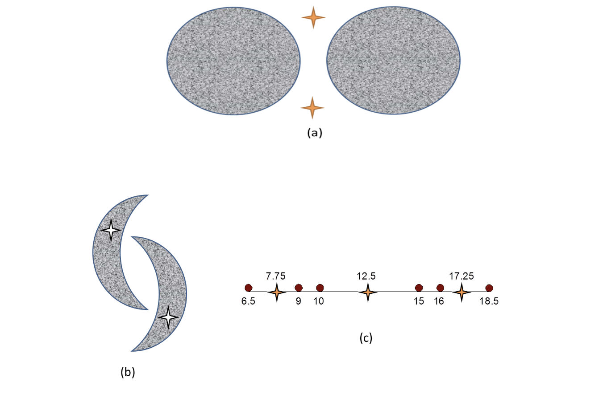
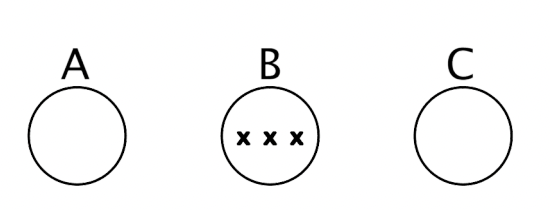
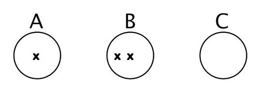
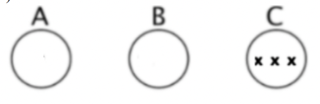

# Question 1

\textbf{For each of the described data sets, decide what type of clustering should be used (hierarchical or partitional, exclusive or non-exclusive (overlapping/fuzzy), complete or partial (incomplete)). Briefly explain your reasoning if you feel there may be several possible answers. Note: we are using partitional and hierarchical in the more relaxed use of the terms to mean un-nested or nested, respectively.}

\textbf{a) Grouping of cities based on the various locations, namely county (local region), state or province, and country.}

hierarchical, exclusive, complete

\textbf{b) A supermarket manager wants to group all goods into several categories, each of which has multiple subcategories.}

hierarchical, non-exclusive, complete

\textbf{c) You want to group all locations on Earth as to whether they belong to a tropical rainforest, a deciduous forest, or an evergreen forest. Here, each location corresponds to a grid cell of surface area 1km by 1km, and a location can have more than one variety of forest or may be unforested.}

partitional, non-exclusive (fuzzy), partial. Partial because there will be many grid cells that do not have any forest and will not be interesting to my clustering experiment.

\newpage

# Question 2

To answer the following true/false questions about how k-means operates, refer to figures (a), (b), and (c), below.  Note that we are referring to the very basic k-means algorithm presented in class and not to any of it more sophisticated variants, such as bisecting k-means or k-means++. Note that for all three figures, the initial centroids are given by the symbol:

For figures (a) and (b), assume the shaded areas represent points with the same uniform density. For Figure (c), the data points are given as red dots, and their values are indicated under the dots. No explanation for your answer is necessary unless you feel there is some ambiguity in the figure or the question.

\textbf{a) True or False: For Figure (a) and the given initial centroid: When the k-means algorithm completes, each shaded circle will have one cluster centroid at its center.}

False

\textbf{b) True or False: For Figure (b) and the given initial centroids: When the k-means algorithms completes, there will be one cluster centroid in the center of each of the two shaded regions, and each of the two final clusters will consist only of points from one of the shaded regions. In other words, none of the two final clusters will have points from both shaded regions.}

False

\textbf{c) True or False: For Figure (c) and the given initial centroids, the final clustering for k-means contains an empty cluster.}

True

\newpage

# Question 3

\textbf{In each of the three sets of figures below, assume that circles A and C contain 100,000 points each, and circle B contains 100 points. The X’s are the centroid initializations for each run of K-means clustering. Assume a uniform distribution of points within each circle. Each circle is the same size, and the distances between the circles are to scale. For each figure, you should tell how many centroids should end up in each circle after convergence of K-means clustering. Your answer should be 0, 1, 2, or 3. You should provide a brief justification for each case.}

\textbf{a)}

Number of Centroids in Circle (a): 1

Number of Centroids in Circle (b): 1

Number of Centroids in Circle (c): 1

Brief explanation: The centroids on the left and right will move to A and C respectively after the points from those areas are assigned to them, and the x in the center will remain there, since there are equal number of points on either side.

\textbf{b)}

Number of Centroids in Circle (a): 1

Number of Centroids in Circle (b): 1

Number of Centroids in Circle (c): 1

Brief explanation: The centroid in A will stay where it is, the right centroid will take the points from C and move over there, and the remaining centroid will end up in the middle since it will not get any points from A or C.

\newpage

\textbf{c)}

Number of Centroids in Circle (a): 1

Number of Centroids in Circle (b): 0

Number of Centroids in Circle (c): 2

Brief explanation: The left centroid will get the points from A and B, and then move until it's in A. The other centroids will stay put, taking each a portion of the points in C.

\newpage
