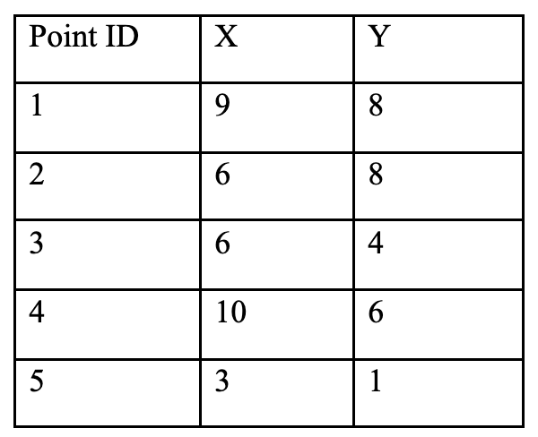
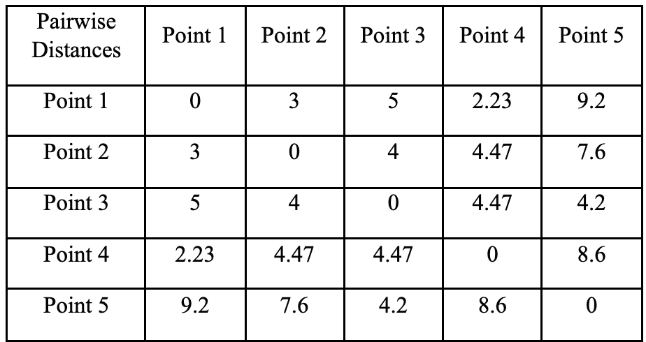
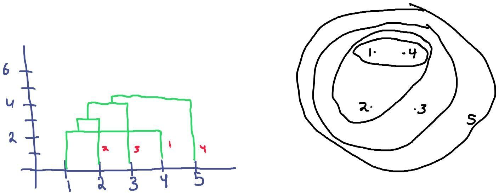
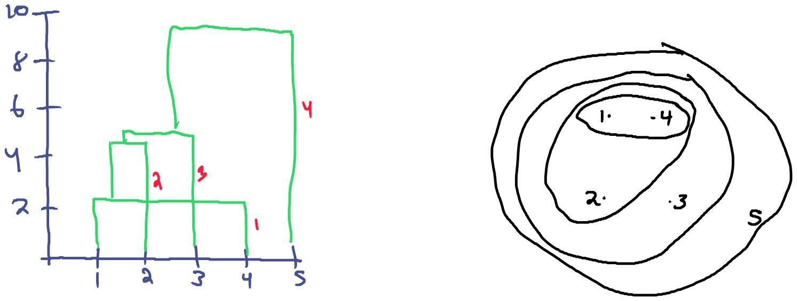
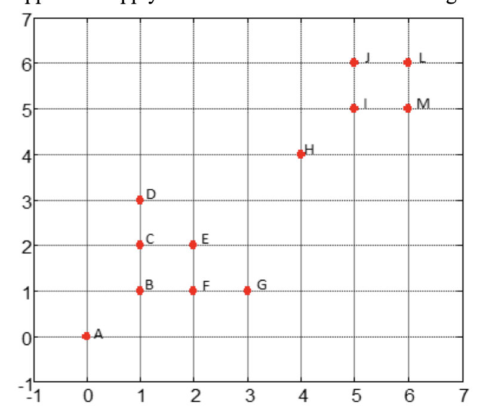
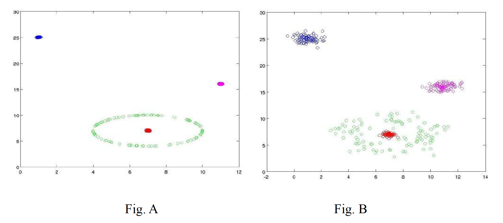
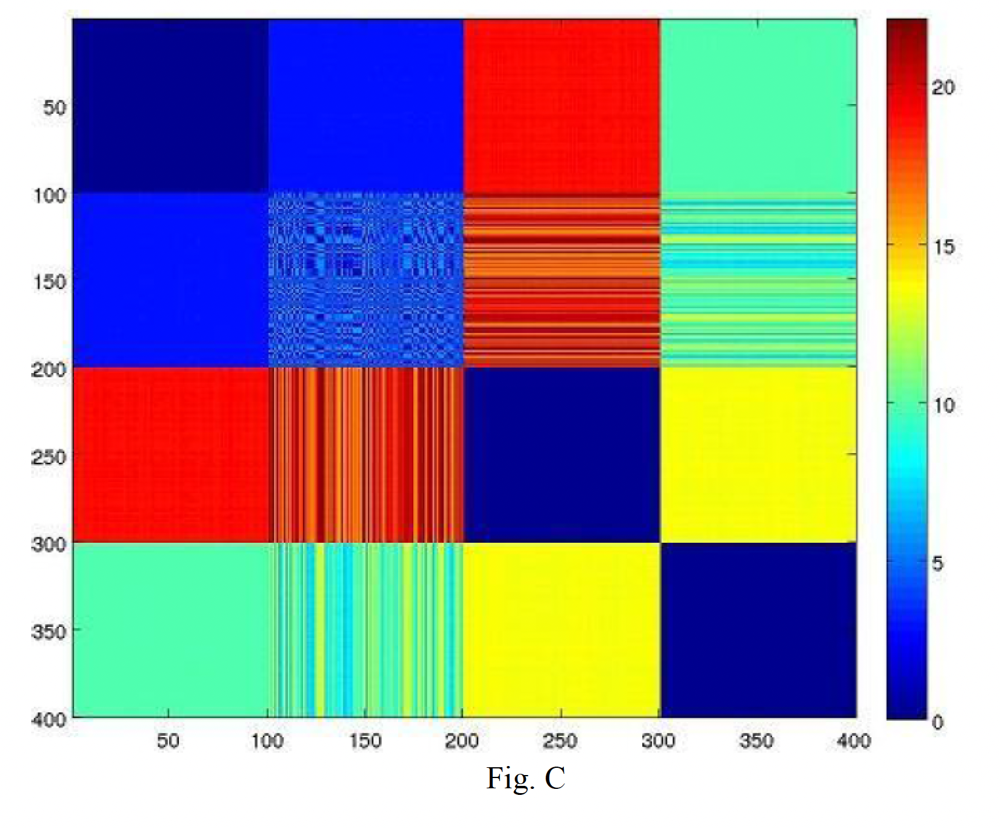
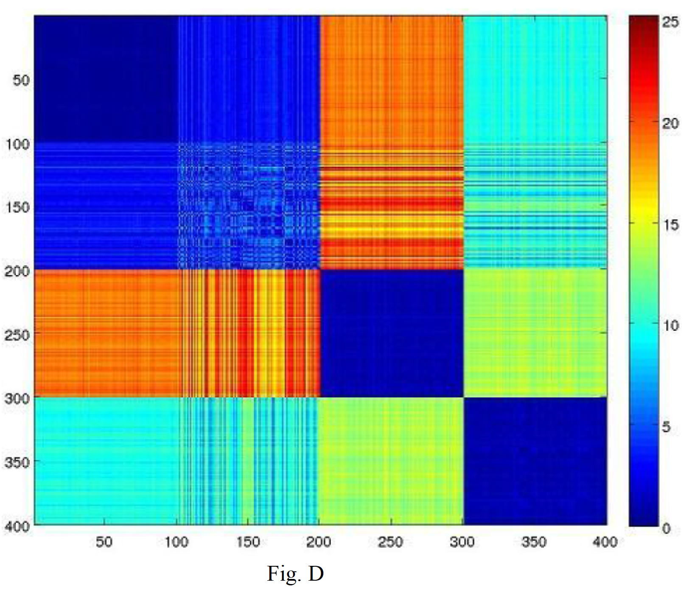
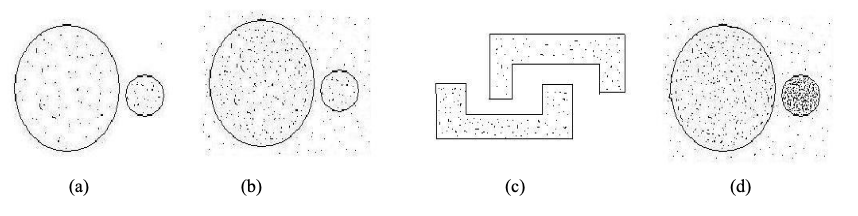

# Question 1

\textbf{For each of the described data sets, decide what type of clustering should be used (hierarchical or partitional, exclusive or non-exclusive (overlapping/fuzzy), complete or partial (incomplete)). Briefly explain your reasoning if you feel there may be several possible answers. Note: we are using partitional and hierarchical in the more relaxed use of the terms to mean un-nested or nested, respectively.}

\textbf{a) Grouping of cities based on the various locations, namely county (local region), state or province, and country.}

hierarchical, exclusive, complete

\textbf{b) A supermarket manager wants to group all goods into several categories, each of which has multiple subcategories.}

hierarchical, non-exclusive, complete

\textbf{c) You want to group all locations on Earth as to whether they belong to a tropical rainforest, a deciduous forest, or an evergreen forest. Here, each location corresponds to a grid cell of surface area 1km by 1km, and a location can have more than one variety of forest or may be unforested.}

partitional, non-exclusive (fuzzy), partial. Partial because there will be many grid cells that do not have any forest and will not be interesting to my clustering experiment.

\newpage

# Question 2

To answer the following true/false questions about how k-means operates, refer to figures (a), (b), and (c), below.  Note that we are referring to the very basic k-means algorithm presented in class and not to any of it more sophisticated variants, such as bisecting k-means or k-means++. Note that for all three figures, the initial centroids are given by the symbol:

For figures (a) and (b), assume the shaded areas represent points with the same uniform density. For Figure (c), the data points are given as red dots, and their values are indicated under the dots. No explanation for your answer is necessary unless you feel there is some ambiguity in the figure or the question.

\textbf{a) True or False: For Figure (a) and the given initial centroid: When the k-means algorithm completes, each shaded circle will have one cluster centroid at its center.}

False

\textbf{b) True or False: For Figure (b) and the given initial centroids: When the k-means algorithms completes, there will be one cluster centroid in the center of each of the two shaded regions, and each of the two final clusters will consist only of points from one of the shaded regions. In other words, none of the two final clusters will have points from both shaded regions.}

False

\textbf{c) True or False: For Figure (c) and the given initial centroids, the final clustering for k-means contains an empty cluster.}

True

\newpage

# Question 3

\textbf{In each of the three sets of figures below, assume that circles A and C contain 100,000 points each, and circle B contains 100 points. The X’s are the centroid initializations for each run of K-means clustering. Assume a uniform distribution of points within each circle. Each circle is the same size, and the distances between the circles are to scale. For each figure, you should tell how many centroids should end up in each circle after convergence of K-means clustering. Your answer should be 0, 1, 2, or 3. You should provide a brief justification for each case.}

\textbf{a)}

Number of Centroids in Circle (a): 1

Number of Centroids in Circle (b): 1

Number of Centroids in Circle (c): 1

Brief explanation: The centroids on the left and right will move to A and C respectively after the points from those areas are assigned to them, and the x in the center will remain there, since there are equal number of points on either side.

\textbf{b)}

Number of Centroids in Circle (a): 1

Number of Centroids in Circle (b): 1

Number of Centroids in Circle (c): 1

Brief explanation: The centroid in A will stay where it is, the right centroid will take the points from C and move over there, and the remaining centroid will end up in the middle since it will not get any points from A or C.

\newpage

\textbf{c)}

Number of Centroids in Circle (a): 1

Number of Centroids in Circle (b): 0

Number of Centroids in Circle (c): 2

Brief explanation: The left centroid will get the points from A and B, and then move until it's in A. The other centroids will stay put, taking each a portion of the points in C.

\newpage

# Question 4

\textbf{Consider a set of 5 points in two-dimensional space, shown in the following table:}

\textbf{Assuming Euclidean distance as the distance measure.The pairwise distance matrix between the 5 points has been computed in the below figure for you, where the ijth entry in the matrix corresponds to the distance between point i and point j.x}

\textbf{For this question you are allowed to paste an image of your handwritten/plotted dendrogram as part of the solution.}

\textbf{a) Use the single link (MIN) hierarchical clustering technique for clustering these 5 points and show the dendrogram of the clustering.The dendrogram should clearly show the order in which the points are merged.}

\textbf{b) Use the complete link (MAX) hierarchical clustering technique for clustering these 5 points and show the dendrogram of the clustering.The dendrogram should clearly show the order in which the points are merged.}

\newpage

# Question 5

\textbf{Suppose we apply DBSCAN to cluster the following dataset using Euclidean distance.}

\textbf{A point is a core point if its density (num point within EPS) is >= MinPts. Given that MinPts = 3 and EPS = 1, answer the following questions.}

\textbf{a) Label all points as “core points,” “boundary points,” and “noise.”}

A: noise, B: core, C: core, D: boundary, E: core, F: core, G: boundary, H: noise, I: core, J: core, L: core, M: core

\textbf{b) What is the clustering result?}

One cluster with B, C, D, E, F, G (B, C, E, F are connected points) and another cluster with I, J, L, M and A and H are eliminated

\textbf{c) Repeat the above two questions when EPS = $\sqrt{2}$}

A: boundary, B: core, C: core, D: core, E: core, F: core, G: core, H: boundary, I: core, J: core, L: core, M: core

Result: One cluster with A, B, C, D, E, F, G and another cluster with H, I, J, L, M

\newpage

# Question 6

\textbf{As shown in Fig. A and Fig. B, there are two datasets of 400 two-dimensional data points in 4 different clusters colored by four different colors – blue, red, green, and magenta. Also given are the distance matrices (400 x400) for the two datasets in Fig. C and Fig. D. The colorbar shows the distances between points, with the color blue indicating the lowest distances and the color red indicating the highest.}

\newpage

\textbf{(a) Match the matrices with their corresponding datasets and provide a brief justification.}

D corresponds to data set B and C corresponds to A. The clusters in A are more tightly clustered, so I expect to see mostly blue on the diagonal, which C exhibits.

\textbf{(b) Also, figure out the corresponding rows (or columns, doesn’t matter which as the matrix is symmetric) representing the points of each cluster. Assume that the rows corresponding to the points of a cluster are consecutive. Therefore, Rows 1-100 belong to the same cluster, Rows 101-200 belong to the same cluster, and so on.}

A: red: 1-100, green: 101-200, blue: 201-300, pink: 301-400

B: red: 1-100, green: 101-200, blue: 201-300, pink: 301-400

\newpage

# Question 7

\textbf{Comparison of clustering algorithms.}

\textbf{a. List one advantage and one disadvantage  of EM (Gaussian mixture model clustering) over fuzzy c-means.}

Advantage: EM can find clusters of various shapes and sizes because they are more general than fuzzy c-means.

Disadvantage: it is computationally expensive

\textbf{b. Discuss the relative performance of  MAX and MIN agglomerative clustering for the followingcases:}

\textbf{i) presence of noise}

MAX handles noise better, because proximity is determined by the furthest point in a cluster.

\textbf{ii) high dimensional data}

Both MAX and MIN clustering have difficulty with high dimensional data, because all merges are final. MIN may be slightly better, though, because it is less biased towards globular clusters and won't break up larger clusters as the distance of the furthest point doesn't determine cluster assignment as in MAX.

\newpage

# Question 8

\textbf{You have the choice of using single-link, complete-link, and DBSCAN to perform clustering for the following cases? The cluster density is the same for the first three cases (a-c), while the last case (d) has one dense cluster with 50000 points and one relatively sparse cluster with 50 points with noise data points in between. Assume that the points inside a boundary are denser than the points outside the boundary, which represent the noise points (cases b and d). Cases a and c do not have any noise points. Note that the label of each diagram in the following figure matches the corresponding part of this question, e.g., Figure (a) goes with question part (a)}

\textbf{a) Which of the three schemes will perform the worst? Why?}

I think complete-link would perform the worst. Since the clusters are relatively sparse, it might end up splitting them up, especially the larger one.

\textbf{b) Which of the three schemes will perform the best? Why?}

DBSCAN handles noise the best, because it is based on density. Since the noise points are sparser than the clusters, DBSCAN will correctly label the noise points as such.

\textbf{c) Which of the three schemes will perform the worst? Why?}

Complete link would perform the worst, since the clusters are not globular and complete link doesn't handle those cases well. There is also a risk of the algorithm splitting up the clusters.

\textbf{d) How will DBSCAN perform? Will it depend on the density of noise?}

It will not do well here. Because you choose a value for EPS and minpts, it doesn't handle the variation in density between the two clusters. For example, if EPS is set too high, the smaller cluster will pull in noise, if too low, the larger cluster won't be identified. It does depend on noise density, because the difference in density between the small cluster and the noise is much greater than the difference between the density of the large cluster and the noise.
