```{r setup, include=FALSE}
library(latex2exp)
knitr::opts_chunk$set(echo = TRUE)
```
## Experiment 1: Exploratory data analysis

1. How many records are there in the dataset?

3333

2. How many features are there? Name each feature and assign it as binary, discrete, or continuous.

21 features

  \begin{center}
 \begin{tabular}{|l|l|}
 \hline
  Column                 & type    \\ \hline
  state                  & discrete  \\ \hline
  account length         & discrete   \\ \hline
  area code              & discrete   \\ \hline
  phone number           & discrete \\ \hline
  international plan     & binary  \\ \hline
  voice mail plan        & binary  \\ \hline
  number vmail messages  & discrete   \\ \hline
  total day minutes      & continuous \\ \hline
  total day calls        & discrete   \\ \hline
  total day charge       & continuous \\ \hline
  total eve minutes      & continuous \\ \hline
  total eve calls        & discrete   \\ \hline
  total eve charge       & continuous \\ \hline
  total night minutes    & continuous \\ \hline
  total night calls      & discrete   \\ \hline
  total night charge     & continuous \\ \hline
  total intl minutes     & continuous \\ \hline
  total intl calls       & discrete   \\ \hline
  total intl charge      & continuous \\ \hline
  customer service calls & discrete   \\ \hline
  churn                  & binary   \\ 
 \hline
   \end{tabular}
\end{center}

3. As a data scientist, your job is to build a model that identifies customers intending to leave your company. To do that, we prepare our data for the machine learning model. We can have the most advanced algorithm, but if our training data is terrible, our result will be poor. According to your intuition, which features are irrelevant. Briefly explain your reasoning.

State, area code, and phone number are features I would probably leave out unless I had reason to believe network coverage wasn't consistently good everywhere, since where you live and what your phone number is shouldn't affect greatly how satisfied you are with a phone company. The other features I'd consider are international plan, voicemail plan, and number vmail messages, since I see these services as not part of the core functionality.

4. Are there any missing values in the data?

No

5. For the continuous features, what is the average, median, maximum, minimum, and standard deviation values?

 \begin{tabular}{|l|l|l|l|}
 \hline
&           total day minutes & total day charge & total eve minutes \\ \hline
mean        &      179.78 &             30.56   &          200.98   \\ \hline
std        &        54.47 &              9.26   &           50.71   \\ \hline
min        &         0.00 &              0.00   &            0.00   \\ \hline
median        &       179.40 &             30.50   &          201.40   \\ \hline
max        &       350.80 &             59.64   &          363.70   \\ \hline
\end{tabular}

\begin{tabular}{|l|l|l|l|}
\hline
    &   total eve charge &  total night minutes & total night charge    \\ \hline
mean        &      17.08       &        200.87     &           9.04 \\ \hline   
std         &       4.31       &         50.57     &           2.28 \\ \hline   
min         &       0.00       &         23.20     &           1.04 \\ \hline 
median            &   17.12          &     201.20        &        9.05    \\ \hline
max         &      30.91       &        395.00     &          17.77 \\ \hline   
   \end{tabular}
   
 \begin{tabular}{|l|l|l|}
 \hline
   &          total intl minutes & total intl charge  \\ \hline
mean  &               10.24   &            2.76 \\ \hline  
std  &                 2.79   &            0.75 \\ \hline  
min  &                 0.00   &            0.00 \\ \hline 
median  &                 10.30   &            2.78 \\ \hline  
max  &                20.00   &            5.40 \\ \hline
   \end{tabular}


6. What is the average number of customer service calls made by a customer to the company?

1.56

7. In our dataset, data comes from how many states?

51

8. What's the distribution of the Churn" feature. Is the feature skewed?

False: 0.86, True: 0.14 - Yes, this feature is skewed towards false.

9. What's the highest and lowest "total day charge" encountered by the customer? If we sort the dataset in ascending and descending order by "total day charge," what observation can you make regarding the connection between "total day charge" and "churn" rate?

The highest total day charge is 59.64 and the lowest is 0.00. The higher the customer's total day charge, the higher the churn rate.

10. What's the average number of customer service calls made by the user who has churned out of the company? Compare and contrast it with the average number of customer service calls made by the user who is still with the company.

The average number of customer service calls for users who have churned out of the company is 2.23, and the average of those who have not is 1.45. It's higher for those who have left, so number of customer service calls could be a good predictor for whether a customer will churn out.

11. Compare and contrast the average values of numerical features for churned and non-churned users? As a data scientist, what strategy will you recommend to the company to retain more customers?

The features that stand out as being different enough between the churned and non-churned users are: total day minutes - 31 more for churned; total day charge - 5 more for churned; total evening minutes - 13 more for churned; total eve charge - 1.14 more for churned; customer service calls - .78 more for churned. I would advise the company to offer cheaper rates during the day or after a certain number of minutes and to work on improving customer service experience to reduce the amount of customer service calls needed to resolve issues.

12. Assume you have devised a model which states that if international plan" = 'no', then the customer will not churn (i.e., churn" = False). Report accuracy, precision and recall concerning churned" class.

\begin{equation}
  \begin{split}
    Accuracy = \dfrac{TP+TN}{N}= \dfrac{2664+137}{2664+137+186+346}=0.84\\
    Precision = \dfrac{TP}{TP+FP} = \dfrac{137}{137+186} = 0.424\\
    Recall = \dfrac{TP}{TP+FN} = \dfrac{137}{137+346} = 0.284\\
            \end{split}
\end{equation}

13. Calculate P(churn = True | international plan = yes'), P(churn = False | international plan =yes'), P(churn= True | international plan = no'), P(churn = False | international plan =no'). Given that the customer has churned, what are the probabilities that the customer has opted/not-opted for the international plan? Similarly, given that the customer has not churned, what are the probabilities that the customer has opted/not- opted for the international plan?

\begin{equation}
  \begin{split}
    P(churn = True | intl plan =yes) = .424 \\
    P(churn = False | intl plan = yes) = .576 \\
    P(churn = True | intl plan = no) = .115 \\
    P(churn = False | intl plan = no) = .885 \\    
    P(intl plan = yes | churn = True) = \dfrac{.424*.0969}{.1449} = 0.2835 \\
    P(intl plan = no | churn = True) = \dfrac{.115*.9031}{.1449} = .7167 \\
    P(intl plan = yes | churn = False) = \dfrac{.576*.0969}{.855} = .065 \\
    P(intl plan = no | churn = False) = \dfrac{.885*.9031}{.855} = .935 \\
            \end{split}
\end{equation}

14. Calculate the probability of customers leaving the company, given that he has not made any customer service call. Compare and contrast it with the customer making 1,2,3,4,5,6,7,8,9 customer service calls. Plot the probability of customers leaving the company as customer service calls increase.

\begin{center}
  \begin{tabular}{|l|l|}
  \hline
  number of calls & churn rate \\ \hline
  0 & 0.131 \\ \hline
  1 & 0.103 \\ \hline
  2 & 0.114 \\ \hline
  3 & 0.102 \\ \hline
  4 & 0.457 \\ \hline
  5 & 0.606 \\ \hline
  6 & 0.636 \\ \hline
  7 & 0.555 \\ \hline
  8 & 0.5 \\ \hline
  9 & 1.0 \\ 
  \hline
  \end{tabular}
\end{center}

```{r}
x <- seq(0,9)
y <- c(0.131, 0.103, 0.114, 0.102, 0.457, 0.606, 0.636, 0.555, 0.5, 1.0)
plot(x, y, main="Churn probability by service calls", xlab="Number of customer service calls", ylab="Probability", type="b")
```

15. Assume you have devised a model which states that if international plan" = yes" and the number of calls to the service center is greater than 3, then the customer will churn (i.e., churn" = True). Report accuracy, precision and recall concerning churned" class.

accuracy: 0.858 

precision: 0.039 

recall: 0.678 


\newpage

## Problem 2

The files for this problem is under Experiment 2 folder. Datasets to be used for experimentation: telecom churn.csv. Jupyter notebook: Decision Trees and kNN.ipynb. In this experiment we will apply and visualize decision trees, kNN, finetune parameters and learn about k-fold cross validation etc. To visualize decision tree we need additional packages to be installed i.e. Graphviz and pydotplus. Answer the following questions:

1. Decision tree classifier sklearn:tree:DecisionTreeClassifier has parameter "max depth" which defines the maximum depth of the tree and "criterion" which measure the quality of the split. What happens if we don't specify any value for both parameters?

The criterion defaults to gini. Although the leaves all end up having 0 values for the gini index, and are thus more pure, the number of samples in each node is much lower, and the tree complexity is much higher because of the lack of constraint to max depth.

2. For the synthetic dataset, we separate two classes by training a decision tree. What does the boundary look like when we overfit ( max depth >= 4 ) and underfit (max depth = 1) the decision tree on data. For both cases, paste the decision tree and the decision boundary from Jupyter notebook output.

When max depth = 1, the decision boundary is a straight line, with several data points in the wrong class. When max depth is unlimited, the decision boundary becomes erratic and complex. It's clear that it wouldn't generalize well, even though it does appear to classify all of the training points correctly.

Underfit:

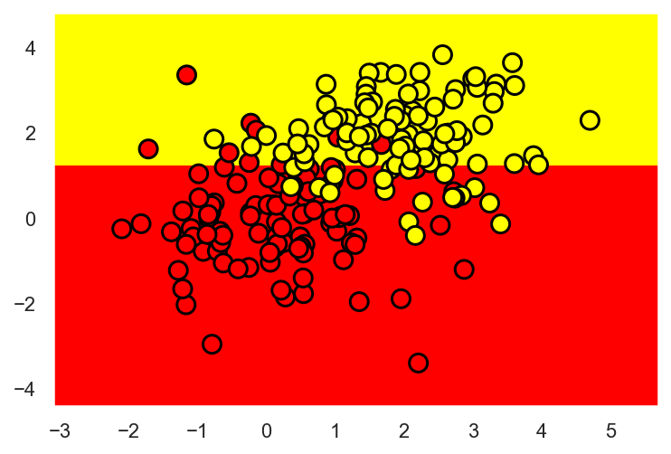
\newpage

Overfit:

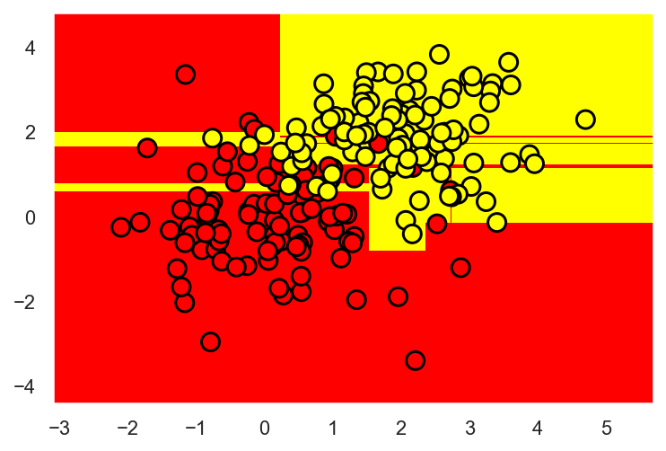

3. For Bank Dataset, what are the 5 different age values that the decision tree used to construct the split the tree? What is the significance of these 5 values?

age > 43.5

32 < age <= 43.5

30 < age <= 32

22.5 < age <=30

19 < age <= 22.5

These are exactly the mean values between the ages at which the target class "switches" from 1 to 0 or 0 to 1, so they represent a threshold between paying the loan and defaulting.

4. Given a dataset d, with n sample and m continuous features, what does Standard Scaler sklearn:preprocessing:StandardScaler do? Given dataset d = [[0, 0], [0, 0], [1, 1], [1,1]], write down its scaler transformation.

It centers and scales the data.

Resulting data: d' = [-1., -1.], [-1., -1.], [ 1.,  1.], [ 1.,  1.]]

5. In section Underftting and Overftting (Jupyter notebook) , we have classified two sets of data (smaller dataset and big dataset) using two different decision trees to demonstrate underffitting and overfitting. Briefly describe the experiments done and what do you learn from this experiments?

When you have a small amount of data, using an overly complex model leads to overfitting - the large decision tree on the small data set shows that - while if you have a large enough data set, a more complex model can achieve better results than a simpler one.

6. In section Imbalance Class (Jupyter notebook) , we have trained a couple of classifiers on the balanced and unbalanced dataset and evaluated its accuracy on balanced and unbalanced dataset. Furthermore, we have printed out the confusion matrix. Briefly describe the experiments done, and what do you learn from these experiments? Also, write down precision, recall, and f1 score for the experiments.

These experiments test how well classifiers generalize when going from balanced to imbalanced, balanced to balanced, imbalanced to balanced and imbalanced to imbalanced data. One observation that can be made is that, in terms of accuracy, the classifier performs about the same for generalizing to balanced and imbalanced data when trained on a balanced data set, but when trained on the imbalanced data set, it generalizes much better to imbalanced data than it does to balanced test data, perhaps due to a bias towards the skew in the training data. Imbalanced to imbalanced appears to have the best accuracy, but let's examine the other scores.

\begin{center}
  \begin{tabular}{|l|l|l|l|l|}
  \hline
  & 1 & 2 & 3 & 4 \\ \hline
  precision & 0.271 & 0.804 & 1.0 & 0.0 \\ \hline
  recall & 1.0 & 0.774 & 0.157 & 0.0 \\ \hline
  f1 & 0.052 & 0.789 & 0.272 & 0.0 \\
  \hline
  \end{tabular}
\end{center}

1 - Training on balance and test on imbalance, 2 - Training on balance and test on balance, 3 - Training on imbalance and test on balance, 4 - Training on imbalance and test on imbalance

The best overall performance is 2, training on balanced and testing on balance, although 3 - imbalanced -> balanced - has high precision. This may be due to the fact that the training data was highly skewed in favor of negative class, so the likelihood of getting a false possitive is very low. And 1 - balanced -> imbalanced - has high recall, which may be explained by the high skew towards negative cases, making it unlikely to get a false negative.

7. In section Adding irrelevant attributes (Jupyter notebook) , we have added an irrelevant attribute to the dataset and have trained a decision tree classifier on it. Based on the test set results, what do you think has happened, and can you collaborate it with the class material? Briefly describe the experiment done, and the intuition developed from these experiments.

The accuracy decreased, but only .04. This matches the understanding from class. The irrelevant attribute is prioritized lower in the tree, following the attributes which have more predictive power. Further, adding a max depth to the tree makes the performance of the noisy data set almost as good as the non-noisy one, with a difference of .02 at a max depth of 12.

8. For the customer churn prediction task, we show that the accuracy of the decision tree is 94% when max depth is set to 5. What happens to accuracy when we leave the value of max depth to its default value? Explain the rise/fall of accuracy.

The accuracy decreases to .92 when the max depth is not set, because the model is too complex and does not generalize well to the test data.

9. How many decision trees do we have to construct if we have to search the two-parameter space, max depth[1-10] and max features[4-18]? If we consider 10-fold cross-validation with the above scenario, how many decision trees do we construct in total?

1-fold: 10 * 15 = 150 decision trees 

10-fold: 10 * 15 * 10 = 1500 decision trees

10. For the customer churn prediction task, what is the best choice of k[1-10] in the k-nearest neighbor algorithm in the 10-fold cross-validation scenario?

knn__n_neighbors: 9, score: 0.8868

11. For MNIST dataset, what was the accuracy of the decision tree [max depth = 5] and K-nearest neighbor [K = 10]? What are the best parameters and accuracy for holdout dataset for decision trees when we used GridSearchCV with 5 fold cross-validation?

Decision tree accuracy (max depth=5) is 0.6666 

K-Nearest neighbor accuracy (K=10) is 0.9759 

max_depth = 10, max_features = 50, accuracy = 0.8568

\newpage

## Problem 3

The files for this problem is under Experiment 3 folder. Datasets to be used for experimentation: spam.csv. Jupyter notebook: Naive Bayes Spam.ipynb. The dataset contains 5,574 messages tagged according to ham (legitimate) or spam. In this experiment we will learn about text features, how to convert them in matrix form and Naive Bayes algorithm.

Answer the following question :

1. How many records are there? What’s the distribution of the “label” class. Is it skewed?

There are 5572 records - 4825 ham and 747 spam. Yes, it is skewed towards ham.

2. How many unique SMS is there in the dataset? What is the SMS that occurred most frequently and what is its frequency?

There are 5169 unique messages. The most frequent message is "Sorry, I'll call later" and it appears 30 times in the data set.

3. What is the maximum and minimum length of SMS present in the dataset? Plot the histogram of the length of SMS with bin size 5,10,20,50,100,200. What can you perceive after examining the plots?

Max length: 910, min length: 2

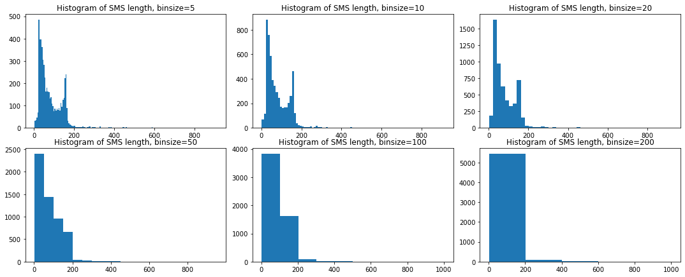
There is a large number of SMS in the ~25-50 range wiht another spike at around 150 words. Between 50 and 100, there is a smaller amount of SMS and a very small amount exceed 200.

4. Plot the histogram of the length of SMS for each label separately with bin size 5,10,20,50 i.e. histogram of the length of all ham SMS and histogram of the length of all spam SMS. What can you perceive after examining the plots?

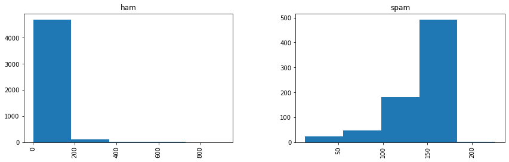
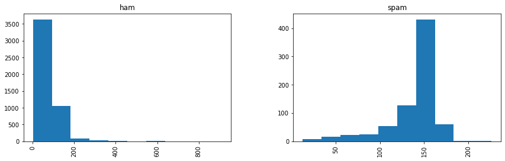
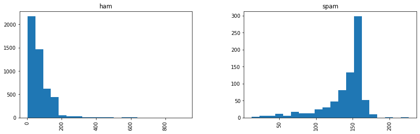
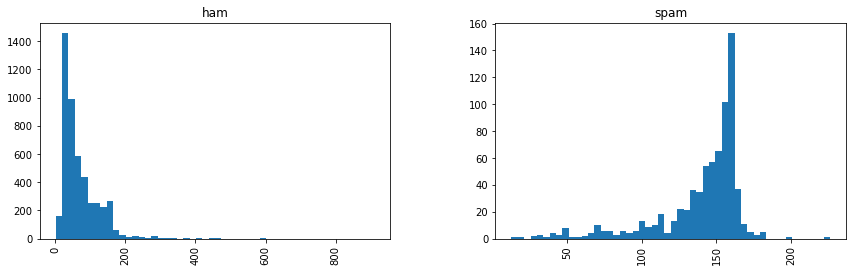
The spam messages tend to be much longer than the ham messages, and there is less variance in length.

5. In the Bag of words approach, we convert all strings into lower cases. Why did we do that, and why is it important? Can we convert all strings into the upper case and still fulfill our original goal?

If we didn't do that, then a word appearing at the beginning of a sentence and the same word appearing in the middle, would not be counted as the same word because of the capital letter. The same can be accomplished by uppercasing all of the words.

6. What does CountVectorizer achieve? What will happen if we set stop words = ”english”. Give five examples of stop-words in English.

CountVectorizer prepares text data for ML algorithms by making it lowercase, removing punctuation, and tokenizing the documents. If we set stop words = 'english', it will also remove stop words. Stop words are frequent words that don't add much information, such as 'of', 'the', 'at', 'a', and 'to'.

7. Given a dataset, how do we generate a document-term matrix? Do we first generate document-term matrix and then separate matrix into train/test or first separate the data into train/test and then generate document-term matrix based on train dataset and afterwards generate matrix for test set? Explain your reasoning.

First, we separate the data into training and test sets and then generate the document-term matrix. Separating the document-term matrix would be a cumbersome process, because you would have to remove terms from one matrix if there was only one document that contained it in the first place and it was being pulled into the test set.

8. Using bag of words approach, convert documents = [’Hi, how are you?’, ’Win money, win from home. Call now.’, ’Hi., Call you now or tomorrow?’] to its document-term matrix.

\begin{center}
    \begin{tabular}{ | l | l | l | l | l | l | l | l | l | l | l | l | l | }
    \hline
    & are &	call &	from &	hi &	home &	how &	money &	now &	or &	tomorrow &	win &	you \\ \hline
    0 &	1 &	0 &	0 &	1 &	0 &	1 &	0 &	0 &	0 &	0 &	0 &	1  \\ \hline
    1 &	0 &	1 &	1 &	0 &	1 &	0 &	1 &	1 &	0 &	0 &	2 &	0  \\ \hline
    2 &	0 &	1 &	0 &	1 &	0 &	0 &	0 &	1 &	1 &	1 &	0 &	1  \\ 
    \hline
    \end{tabular}
\end{center}

9. How many features are created while making document-term matrix for SMS dataset? Can you think of a method to reduce the number of features? List the pros and cons of the method.

There are 7777 features. I could perform a dimensionality reduction algorithm. This would improve the performance of the downstream processes without losing significant predictive power. I would try removing stop words before reducing dimensions as well. The problem with this approach is that it could lead to some data loss.

10. For our input dataset, which Naive Bayes model should we use, Gaussian Naive Bayes or Multinomial Naive Bayes? Explain your reasoning ? Report accuracy, precision, recall and F1 score for the spam class after applying Naive Bayes algorithm.

Multinomial works better, because it works well with discrete data, and our data are word counts.

Accuracy score: 0.9847

Precision score: 0.9420

Recall score: 0.9352

F1 score: 0.9386281588447652

\newpage

## Problem 4

The files for this problem is under Experiment 4 folder. In this assignment, we provide three real-world datasets for classification, i.e., Iris dataset (https://archive.ics.uci.edu/ml/datasets/Iris), Thyroid dataset (https://archive.ics.uci.edu/ml/datasets/Thyroid+Disease), and Diabetes dataset (https://www.kaggle.com/uciml/pima-indians-diabetes-database). Also, we give three jupyter notebooks, one for each dataset, in which we have applied k-nearest neighbor, decision tree, and Naive Bayes Algorithm without any parameter tuning. Write a report (no longer than a page) for each dataset; you can be as innovative as you want, giving your analysis about the dataset, your observations, and comments. Minimally, the report should include brief description of the dataset, the number of observations, missing value or not, testing strategy deployed, classification accuracy of algorithms, intuition developed by running the notebooks etc.

**Iris Dataset**

The iris dataset has 150 records with 4 features and a class column. The data is dense, with no missing attribute values. The four features, all continuous, are Sepal length, sepal width, petal length, and petal width. The possible classes are Iris setosa, Iris versicolor, and Iris virginica, and the samples are evenly distributed among those classes, making it a balanced dataset.

The models used for classification were K-nearest neighbor, decision tree, gaussian naive bayes and bernoulli naive bayes. The first three classifiers performed similarly under 10-fold cross-validation, hovering around .9, while the bernoulli model only managed a .33 score, likely due to the data being continuous rather than discrete. Decision tree also performed slightly lower than KNN or Naive Bayes. 

This may be due to the difficulty in finding a single feature that cleanly separates Iris versicolor from Iris virginica. From the pair plots it is easy to see that single features fail to do this. Since decision trees are not as good at handling interacting attributes, this method didn't perform as well.

Results:

KNN  0.960000

DT  0.946667

BNB  0.333333

GNB  0.960000

**Thyroid dataset**

The thyroid dataset has 5 features and a class column and 215 instances. The features are T3 resin(discrete), serum thyroxin (continuous), serum triiodothyronine (continuous), basal TSH (continuous), abs diff TSH (continuous). The data is unequally distributed among three classes, making it an imbalanced data set. There are no null values, making it dense.

The same models and scoring methods were used as in the Iris dataset. Here, we have better performance in bernoulli naive bayes, but the best overall performance is by the gaussian naive bayes. 

Looking at the pairplots for this dataset, it is clear why KNN might not perform as well as it did for the Iris data set. The decision boundaries are not as well defined, so KNN will be difficult to do. Again, we have very good performance from Gaussian naive Bayes, which may indicate that it is a good general model. Decision tree again struggled with the feature interactions, as is evident in the pair plot.

Results:

KNN  0.938745

DT  0.943939

GNB  0.966883

BNB  0.735065

**Diabetes dataset**

The diabetes dataset has 8 features - pregnancies (discrete), glucose (discrete), blood pressure(discrete), skin thickness (discrete), insulin (discrete), BMI (continuous), diabetes pedigree function (continuous), and age (discrete), with a binary outcome class. There are 768 records.

This data is skewed towards negative class, with 500 negative and 268 positive. It is dense, with no missing attribute values. However, there are attributes with 0 values for some of the attributes where one wouldn't expect them, such as skin thickness, insulin, BMI, and blood pressure. So, those records are removed before applying the different models.

In this example, two methods were applied - train/test split and 10-fold cross validation. The results of the train/test split are as follows:

KNN  0.729282

DT  0.723757

GNB  0.734807

BNB  0.657459


And the results of 10-fold cross validation:

KNN  0.701636

DT  0.697355

GNB  0.755613

BNB  0.656069

The train/test split method worked slightly better across all of the chosen models, although overall performance is relatively poor. One interesting thing to note is that when I set max depth of the decision tree to 1, the performance of decision tree improves, both for train/test split and 10-fold cross validation. This may indicate that there is one feature which on its own can predict as well as the rest combined. Looking at the pair plot, my guess would be that feature is glucose.

\newpage

## Problem 5

In this experiment, you will participate in a Kaggle competition Titanic: Machine Learning from Disaster. Kaggle is the world’s largest community of data scientists that host data science competitions that can be intimidating for beginners to join. The goal of the assignment is to make you familiar with the Kaggle competitions and give you a path forward to hone your data science skills after you have completed the data mining class. By participating in the competition, you will have the opportunity to learn from other people’s machine learning code and contribute to the community. On a side note, some of the listed competitions have over $1, 000, 000 prize pools.

Proceed to the following link https://www.kaggle.com/c/titanic/overview and follow the description carefully. Then check out Alexis Cook’s Titanic tutorial https://www.kaggle.com/alexisbcook/titanic-tutorial and get ready to make your submission. In a few seconds, your submission will be scored, and you’ll receive a spot on the leaderboard. For each of the questions below, write down the accuracy obtained, position on the leaderboard, and put the screenshot of the leaderboard where your username, rank, and accuracy are clearly visible.

1. Submit example gender submission.csv file that predicts that all female passengers survived, and all-male passengers died.

Score: .7655

Leaderboard position: 11752

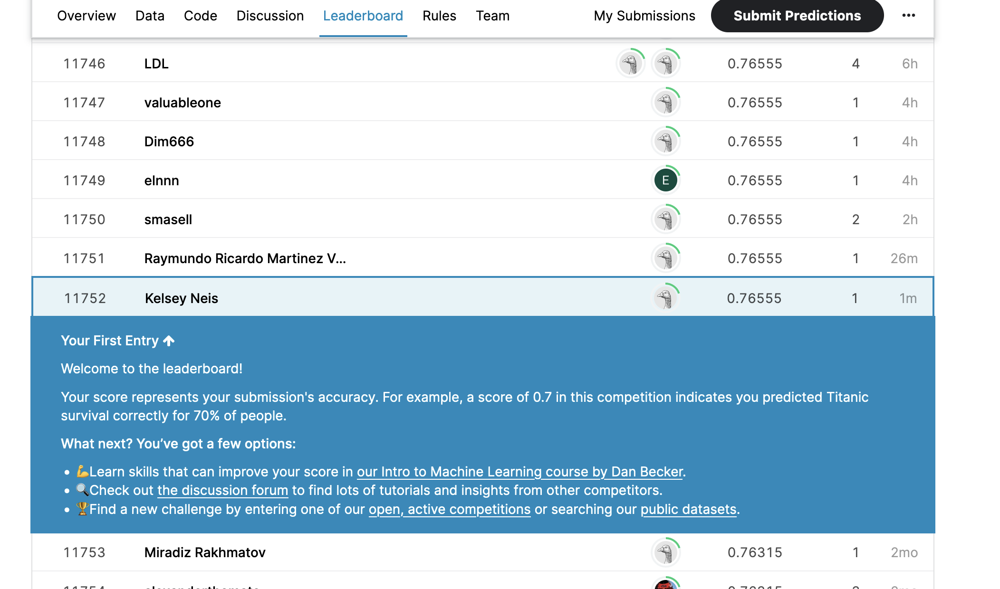

2. Submit the gender submission.csv file that predicts that all passengers survived.

Score: .3779

Leaderboard: since it didn't improve, Kaggle kept my previous attempt as my leaderboard ranking.

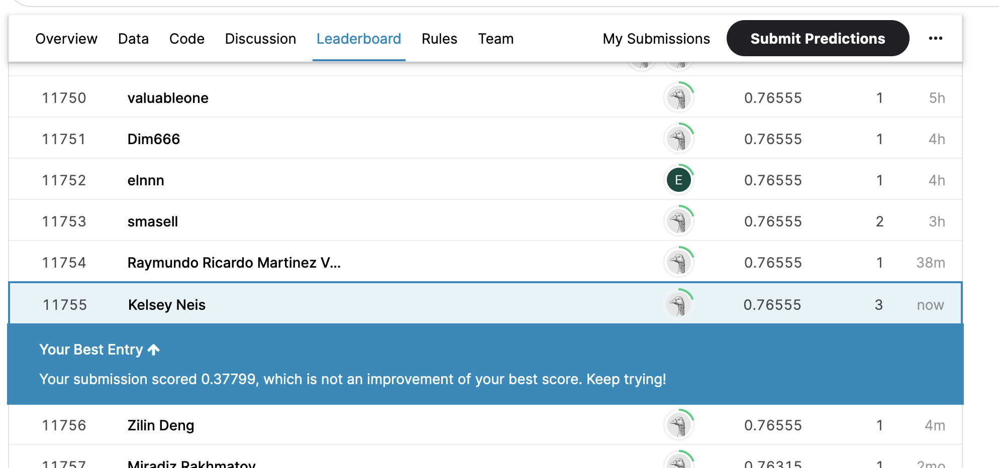

3. Submit the gender submission.csv file that predicts that all passengers died.

Score: .622

Leaderboard: did not change

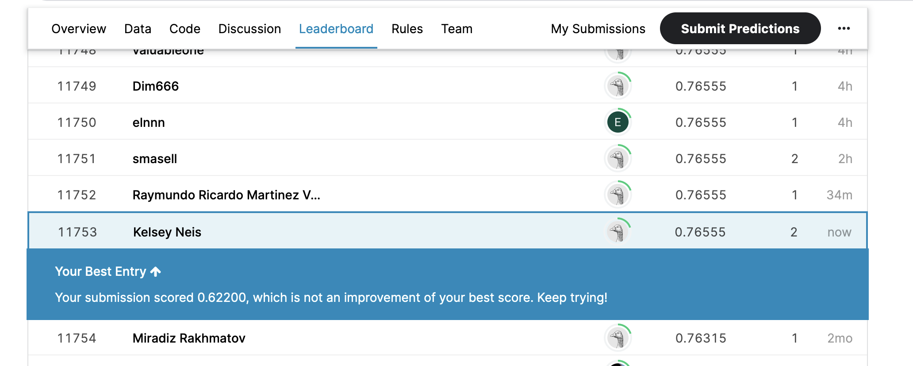
4. Submit the model output of the random forest model as detailed in the tutorial. Try to play with the number of decision trees ( we constructed 100) and see if accuracy improves.

**Trees=100**

Score: .775

Leaderboard position: 8745

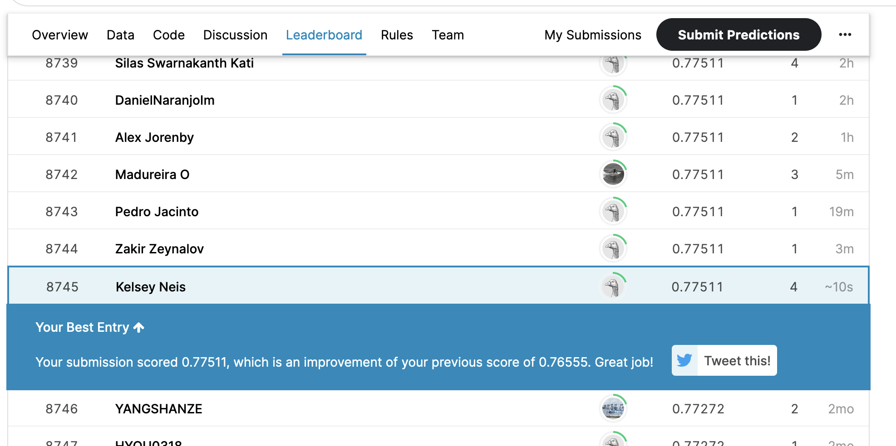
**Trees=500**

Score didn't change

**Trees=50**

Score: .7775

Leaderboard: 4094

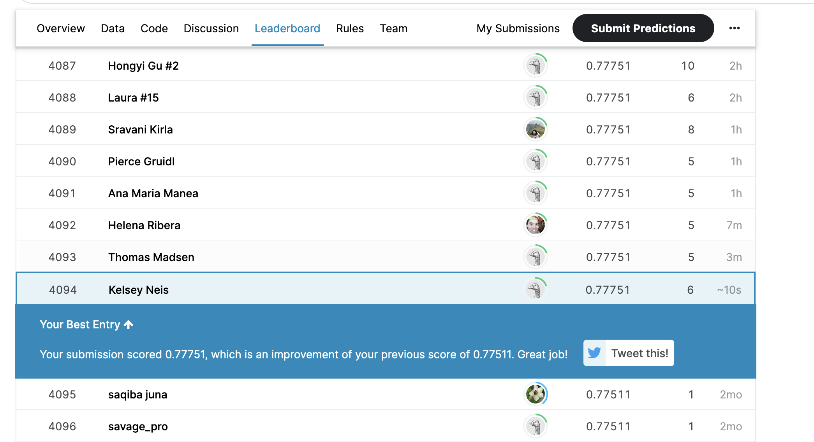
5. Copy and Edit the kernel in https://www.kaggle.com/ldfreeman3/a-data-science-framework-to-achieve-99-accuracy. Submit the model output from the kernel, write a short (half page to a page) report on what the kernel does and include the position on the leaderboard, screenshot as detailed above.


The kernel pre-processes the data, either removing features with sparse data or setting some default value, as with age to ensure that the data is dense before running algorithms against it. Then it splits the data into testing and training sets. After that, there is some exploratory analysis to try to find important features and correlations between them.

In order to find the best algorithm for this scenario, the kernel then trains several different models and tunes their parameters. This includes a hand-made model in which the writer selected criteria based on their analysis and hardcoded the rules into the model.

Once the models have all been tuned by selecting features and hyperparameters, the best one is selected and run against the training set. This results in .7775 accuracy, which is not an improvement on the random forest, although better results could potentially be achieved with the hand-made model, which the author poses as the best method when it comes to small data sets.

Score: .7775

Leaderboard: 4099

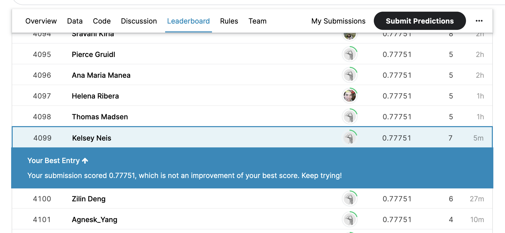