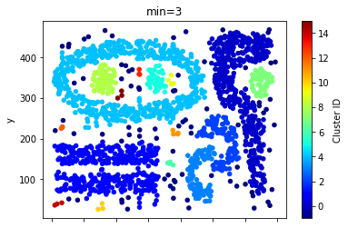

```{r setup, include=FALSE}
knitr::opts_chunk$set(echo = TRUE)
```

## Problem 1

The files for this problem is under Experiment 1 folder. Datasets to be used for experimentation: store transaction.csv. Jupyter notebook: apriori analysis.ipynb. In this experiment, we give a dataset of a store with thousands of transactions of customers buying several items from the store. We will use the apriori algorithm to find correlations between various items in the store. 

Answer the following question :

1. How many records are there in the dataset?

7501

2. In a single transaction, what is the maximum number of items a customer has bought? We assume that each record is a separate transaction

20

3. Write any five transactions a customer has done.

{burgers,meatballs,eggs}

{chutney}

{turkey,avocado}

{mineral water,milk,energy bar,whole wheat rice,green tea}

{low fat yogurt}

4. We use the wordcloud to generate a stunning visualization format to highlight crucial textual data points and convey essential information. Generate and paste the wordcloud with max words set to 25 and 50. Briefly describe your understanding of the plot.


These plots show the top 25 and top 50 items bought by customers, represented by their size in the cloud.

5. What are the top 5 most frequent items in the dataset?

Mineral water, eggs, spaghetti, french fries, chocolate

6. Suppose we have the following transaction data: [[’Apple’, ’Beer’, ’Rice’, ’Chicken’], [’Apple’, ’Beer’, ’Rice’], [’Apple’, ’Beer’], [’Apple’, ’Bananas’], [’Milk’, ’Beer’, ’Rice’, ’Chicken’], [’Milk’, ’Beer’, ’Rice’], [’Milk’, ’Beer’], [’Apple’, ’Bananas’]]. Transform this input dataset into a one-hot encoded Boolean array. Hint: In the Jupyter notebook, we use TransactionEncoder to do the same.

\begin{center} 
  \begin{tabular}{|l|l|l|l|l|l|}
    \hline
    &	Apple &   	Bananas & 	Beer &    	Milk &    	Rice \\ \hline    	
0 &  	True	 &    False &   	True &    	False &   	True \\ \hline
1 &  	True	 &    False &   	True &    	False &   	True \\ \hline
2 &  	True	 &    False &   	True &    	False &   	False \\ \hline
3 &  	True	 &    True &    	False &   	False &   	False \\ \hline
4 &  	False &   	False &   	True &    	True &    	True \\ \hline
5 &  	False &   	False &   	True &    	True &    	True \\ \hline
6 &  	False &   	False &   	True &    	True &    	False \\ \hline
7 &  	True	 &    True &    	False &   	False &   	False \\ \hline
  \end{tabular}
\end{center}


7. In the input dataset, how many unique items are present?

121

8. Run Apriori to generate frequent itemsets at support thresholds of 1%, 2%, 3%, 4%, 5%, 6%, 8%,10%,12%,16% and 20%. In a single figure, for each threshold (X-axis), plot the number of itemsets (Y-axis). Comment on the general trends illustrated by the plots and the reason for the trend.


As expected, the number of itemsets decreases proportionally as the threshold increases.

9. At support threshold 1%, we see frequent itemset of size three along with size 2 and 1. However, at the support threshold of 2%, we observe itemsets of size 1 and 2 only. Why do you think this is so?

The larger the itemset, the less likely it will be frequent. 1- and 2-itemsets, in other words, 1-word and 2-word pairs are more likely to be frequent than a 3-word sequence.

10. Run Apriori to generate frequent itemsets of length 2 at support thresholds of 1%, 2%, 3%, 4% and 5%. In a single figure, for each threshold (X-axis), plot the number of itemsets of length 2 (Y-axis). Comment on the general trends illustrated by the plots and the reason for the trend.


The count of frequent 2-itemsets follows a similar trend to the plot not constrained by itemset size, except that it declines more rapidly as the support threshold increases, perhaps because of excluding the frequent 1-itemsets.

11. For the following itemset, write down its corresponding support value:

•Mineral Water

0.238

•Chocolate

0.164

•Eggs

0.18

•Eggs, Mineral Water

0.051

•Chocolate, Mineral Water

0.053

\newpage

## Problem 2

The files for this problem is under Experiment 2 folder. Datasets to be used for experimentation: instacart transaction.csv. Jupyter notebook: Instacart association.ipynb. Instacart, an online grocer, has graciously made some of their datasets accessible to the public (https://www.instacart.com/datasets/grocery-shopping-2017). In this experiment, we will use apriori algorithm to find correlations between the different items in the store. Answer the following question:

1. Given following transactions:

• order 1: apple, egg, milk

• order 2: carrot, milk

• order 3: apple, egg, carrot

• order 4: apple, egg

• order 5: apple, carrot

Using the apriori algorithm, write down the pair of items having a minimum threshold of 3. Briefly describe your steps.

In the first round, gather 1-itemsets: \{apple\}, \{egg\}, \{milk\}, \{carrot\}. Eliminate \{carrot\} and \{milk\} since they don't meet the minimum threshold of 3.

In the second round, gather 2-itemsets from the 1-itemsets that were not pruned: $\fbox{\{apple, egg\}}$ is the only one, and it meets the threshold of 3.

2. How many unique orders and unique items are there in the dataset? Are unique order same as number of records in the dataset? On average, per order, how many items does a customer order?

Unique orders: 3214874, Unique items: 49677

3. Run apriori to generate pairs of itemset at support thresholds of 1%, 2%, 4%, 6%, 8%, and 10%. In a single figure, for each threshold (X-axis), plot the number of association rules (Y-axis). Comment on the trend of algorithm runtime at different thresholds.


The runtime was quite long for the first two, but decreased after that. The total runtime was 17 minutes.

4. Run apriori at support thresholds of 1%, 2%, 4%, 6%, 8% and 10%. For each threshold, write a pair of association rules (you can choose any) along with its key metrics (i.e. freqAB, supportAB, freqA,supportA, freqB, support, confidenceAtoB, confidenceBtoA, lift). As a data scientist for the retailer giant, after observing the association rules, what would you do to increase the sales.

\begin{center}
  \begin{tabular}{|p{1.5cm}|p{1.5cm}|p{1.5cm}|p{1.5cm}|p{1.5cm}|p{1.5cm}|p{1.5cm}|} 
  \hline
  & 1 & 2 & 4 & 6 & 8 & 10 \\ \hline
  itemA & Banana & Banana & Banana & Organic Strawberries & Organic Strawberries & Organic Strawberries \\ \hline
  itemB & Honeycrisp Apple & Organic Baby Spinach & Strawberries & Organic Hass Avocado & Banana & Bag of Organic Bananas \\ \hline
  freqAB & 20196 & 35590 & 29182 & 18424 & 17592 & 21599 \\ \hline
  supportAB & 1.21 & 2.14 & 4.64 & 6.05 & 14.83 & 18.21 \\ \hline
  freqA & 401800 & 401800 & 234940 & 150887 & 117577 & 117577 \\ \hline
  supportA & 24.13 & 24.13 & 37.37 & 49.576 & 99.18 & 99.182 \\ \hline
  freqB & 74704 & 224295 & 83098 & 125640 & 57125 & 62597 \\ \hline
  supportB & 4.48 & 13.47 & 13.22 & 41.281 & 48.18 & 	52.80 \\ \hline
  confidenceAtoB & .05 & .089 & 0.124 & 0.122 & 0.149 & 0.183 \\ \hline
  confidenceBtoA & .27 & .159 & 0.351 & 0.146 & 0.307 & 0.345 \\ \hline
  lift & .011 & .007 & 0.009 & 	0.0029 &	0.0031 & 0.003 \\ \hline
  \end{tabular}
\end{center}

I would suggest placing popular itemset pairs near each other, and move all organic produce to be close together. I'd also make sure that similar items with different color/flavor are placed close together and place healthy snacks together as well. For example, place a healthy snack like nuts near the organic fruit to inspire customers to try something new if they were in the mood for a healthy snack.

\newpage

## Problem 3

The files for this problem is under Experiment 3 folder. Datasets to be used for experimentation: 2d data, chameleon, elliptical, and vertebrate. Jupyter notebook: cluster analysis.ipynb. Cluster analysis seeks to partition the input data into groups of closely related instances so that instances that belong to the same cluster are more similar to each other than to instances that belong to other clusters. In this experiment, we provide examples of using different clustering techniques provided by the scikit-learn library package.


1. In the notebook, k-mean clustering assign users to two clusters i.e., cluster one has a higher rating for action movies, and cluster two has higher ratings for horror movies. Given the cluster centroid, assign the following users to their respective cluster assignment:


Paul: 1 (action)

Adel: 0 (horror)

Kevin: 0

Jessi: 0

2. A fundamental step for any unsupervised algorithm is to determine the optimal number of clusters into which the data can be clustered. The Elbow Method is one of the most popular methods to find the optimal value of k. For the toy example of the movie rating dataset, what is the optimal value of K? Briefly explain your reasoning.


The optimal number of clusters is 2, because the graph elbows at that point. In other words, the amount of accuracy gained past that point if k is increased only changes marginally.

3. On the Vertebrate dataset, we illustrate the results of using three hierarchical clustering algorithms (1) single link (MIN), (2) complete link (MAX), and (3) group average. As a data scientist, given the class of the original dataset, which clustering algorithm makes more sense. Explain your reasoning.


Complete link appears to yield the most accurate dendrogram. Only a few mistakes and two of the clusters could be combined, but it's better than the other two.

4. For DBSCAN, how many clusters are formed when the minimum number of points (min samples) to set to 1, 2, 3, 4, and 5, respectively. For each instance, copy and paste the plot of the clusters.

Min=1: 80

Min=2: 35

Min=3: 17

Min=4: 12

Min=5: 10





5. For elliptical and 2D data, we apply k-means and spectral clustering with the number of clusters(k) = 2. Repeat the same set of clustering for k = 4 and copy and paste the clusters formed. Which cluster method performs well when k =2 and k = 4.

**K-means**

K = 2:


K = 4:


**Spectral clustering**

K=2


K=4


**Spectral clustering performs better at both k=2 and k=4**

\newpage

## Problem 4

The files for this problem is under Experiment 4 folder. Jupyter notebook: covid-19- research-challenge.ipynb. In this experiment, given the large amount of academic literature surrounding COVID-19, you will help overloaded scientists to keep up with the research happening all around the globe for faster development of the vaccine. Given that we have recently studied clustering, can we cluster similar research articles together to make it easier for health professionals to find relevant research articles? Clustering can be used to create a tool to identify related articles, given a target article. Dataset Description: In response to the COVID-19 pandemic, the White House and a coalition of leading research groups have prepared the COVID-19 Open Research Dataset (CORD-19). CORD-19 is a resource of over 29,000 scholarly articles, including over 13,000 with full text, about COVID-19, SARSCoV-2, and related coronaviruses. This freely available dataset is provided to the global research community to apply recent advances in natural language processing and other AI techniques to generate new insights in support of the ongoing fight against this infectious disease. There is a growing urgency for these approaches because of the rapid acceleration in modern coronavirus literature, making it difficult for the medical research community to keep up.

1. After we handle duplicates, what is the count, mean, standard deviation minimum, and maximum values for abstract word count and body word count?

2. Briefly describe the data pre-processing steps done in the notebook for cleaning up the text.

3. For clustering, to create a feature vector, on what part of the article did we focus?

4. What is N-gram in machine learning? Given the following word list: [’the’, ’2019’, ’novel’, ’coronavirus’, ’sarscov2’, ’identified’, ’as’, ’the’, ’cause’, ’of’], what is its 2-gram?

5. What does HashingVectorizer do? What is the feature size of HashingVector that we used in our analysis?

6. We have randomly chosen 10 clusters using k-means clustering, vectorized using hashingVector, which makes some sense if we plot the t-SNE plot as articles from the same cluster are near each other, forming groups. However, there are still overlaps. Can you improve this by changing the cluster size or choosing a different feature size? Give the size of the cluster and the feature size that makes more sense for you. Copy and paste the corresponding t-SNE plot.

7. We have randomly chosen 10 clusters using k-means clustering, vectorized using tf-idf, and we can see clusters more clearly. Can you improve this by changing the cluster size or changing the max features value of TfidfVectorizer? Give the size of the cluster and the max features value that makes more sense for you. Copy and paste the corresponding t-SNE plot.

8. In the interactive t-SNE with 20 clusters, can you do a manual analysis of each cluster to see what articles cluster together? Choose any 5 clusters and write 4-5 keywords that describe it. Hover your mouse over the cluster point, and you can see the article that it refers. You can moreover choose to display points of one cluster only in the plot. Also, name the clusters that include articles involving the social and economic impacts of the coronavirus?
